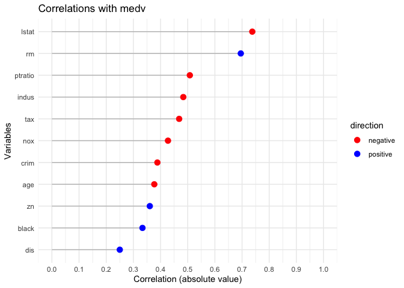

README
================

# rxy

`rxy` is an R package for analyzing correlations between a dependent
variable and multiple independent variables. It includes methods for: -
Printing correlation tables with statistical significance. - Plotting
correlations with color-coded visualizations. - Summarizing correlations
with detailed summaries.

## Installation

To install the package from source, use the following:

devtools::install(“path/to/rxy”)

Usage

Analyze Correlations

Here’s how to use rxy with the Boston dataset from the MASS package:

``` r
library(MASS)
library(rxy)

# Analyze correlations
result <- ryx(Boston, y = "medv")
```

Print Results

Display the correlation results:

``` r
print(result)
```

    ## Correlations of medv with
    ##  variable          r            p sigif
    ##     lstat -0.7376627 5.081103e-88   ***
    ##        rm  0.6953599 2.487229e-74   ***
    ##   ptratio -0.5077867 1.609509e-34   ***
    ##     indus -0.4837252 4.900260e-31   ***
    ##       tax -0.4685359 5.637734e-29   ***
    ##       nox -0.4273208 7.065042e-24   ***
    ##      crim -0.3883046 1.173987e-19   ***
    ##       age -0.3769546 1.569982e-18   ***
    ##        zn  0.3604453 5.713584e-17   ***
    ##     black  0.3334608 1.318113e-14   ***
    ##       dis  0.2499287 1.206612e-08   ***

Visualize Results

Create a plot of the absolute correlations:

``` r
plot(result)
```

<!-- -->

Summarize Results

Summarize the correlations with statistical significance:

``` r
summary(result)
```

    ## Correlating medv with crim zn indus nox rm age dis tax ptratio black lstat 
    ## The median absolute correlation was 0.427 with a range from -0.738 to 0.695 
    ## 11 out of 11 variables were significant at the p < 0.05 level.

Features

Automatic correlation analysis for numeric variables. Customizable
visualizations to understand relationships. Statistical summaries for
in-depth analysis.
